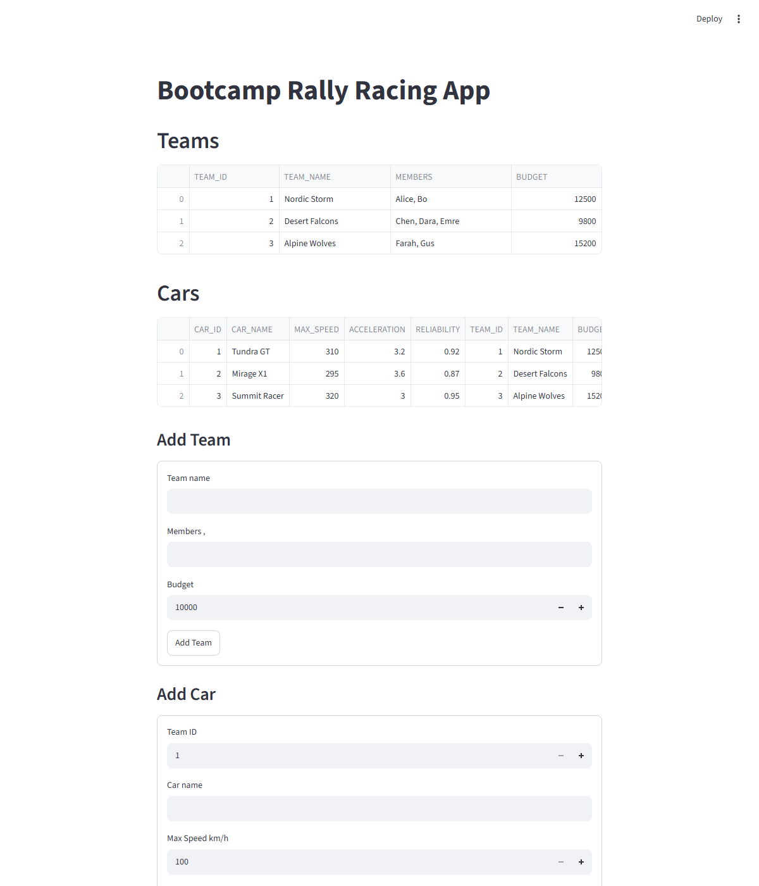
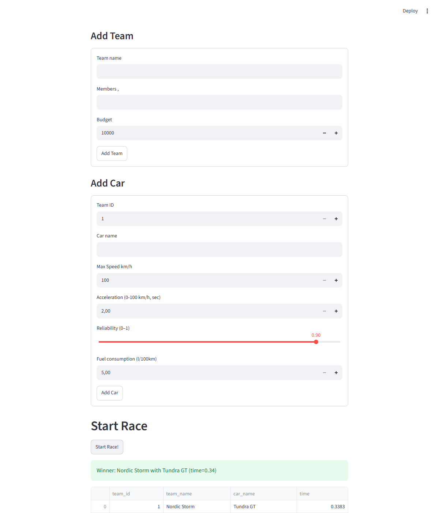
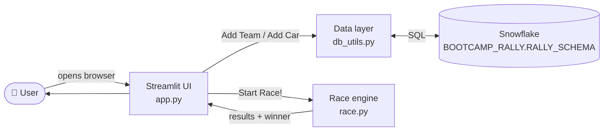

# 🏁 Bootcamp Rally Racing App

A small [Streamlit](https://streamlit.io/) app for a bootcamp assignment: register racing teams
and cars, then simulate a rally race and watch team budgets rise and fall with the results. Data
is stored in [Snowflake](https://www.snowflake.com/).


## Screenshots

> Images below are placeholders — see [`docs/screenshots/README.md`](docs/screenshots/README.md)
> for what to capture and drop in.

| Dashboard | Start a race |
|---|---|
|  |  |

## How it works



For the detailed component diagram, sequence diagram, and data model, see
[**docs/ARCHITECTURE.md**](docs/ARCHITECTURE.md).

## Features

- View all registered teams and their budgets
- View all cars and the team each belongs to
- Register a new team (name, members, starting budget)
- Register a new car for a team (top speed, acceleration, reliability, fuel consumption)
- Simulate a race: every car gets a finish time from its stats plus a reliability-based random
  penalty; the fastest car wins. Every entered team pays a 1000 entry cost, the winning team
  earns 5000.

## Tech stack

- [Streamlit](https://streamlit.io/) — UI and app server
- [pandas](https://pandas.pydata.org/) — result tables and race calculations
- [Snowflake](https://www.snowflake.com/) — data storage (`snowflake-connector-python`)
- [python-dotenv](https://pypi.org/project/python-dotenv/) — local `.env` loading

## Quick start

```bash
git clone https://github.com/arturrw/bootcamp_rally_app.git
cd bootcamp_rally_app
python -m venv .venv
source .venv/bin/activate   # Windows: .venv\Scripts\activate
pip install -r requirements.txt
```

Configure your own Snowflake credentials locally (never commit them) — create
`.streamlit/secrets.toml`:

```toml
[snowflake]
user = "..."
password = "..."
account = "..."
warehouse = "..."
database = "..."
schema = "..."
```

Then run:

```bash
streamlit run app.py
```

Full configuration reference: [**docs/API.md § Configuration**](docs/API.md#configuration-reference).

## Project structure

```
.
├── app.py              # Streamlit UI — presentation layer only
├── race.py             # Race simulation — pure logic, no I/O
├── db_utils.py         # Snowflake connection + SQL — data access layer
├── requirements.txt
├── .devcontainer/       # GitHub Codespaces / VS Code Dev Containers config
└── docs/
    ├── ARCHITECTURE.md
    ├── API.md
    └── screenshots/
```

## Documentation

| Doc | Contents |
|---|---|
| [**docs/ARCHITECTURE.md**](docs/ARCHITECTURE.md) | Layered design, sequence diagram for the race flow, data model, secrets handling |
| [**docs/API.md**](docs/API.md) | Internal Python API (`db_utils.py`, `race.py`), UI-action-to-data-effect table, DB schema, config reference |
| [**CONTRIBUTING.md**](CONTRIBUTING.md) | Dev setup, branching, code style, security notes, how to test `race.py` |

## Security note

An earlier revision of this repo committed a `secrets.toml` with real Snowflake credentials.
That file has been removed from git history and the credentials rotated. See
[docs/ARCHITECTURE.md § Secrets & configuration](docs/ARCHITECTURE.md#secrets--configuration) for
what changed and how secrets should be handled going forward.

## License

No license file yet — add one (e.g. MIT) if this project is meant to be reused outside the
bootcamp.
