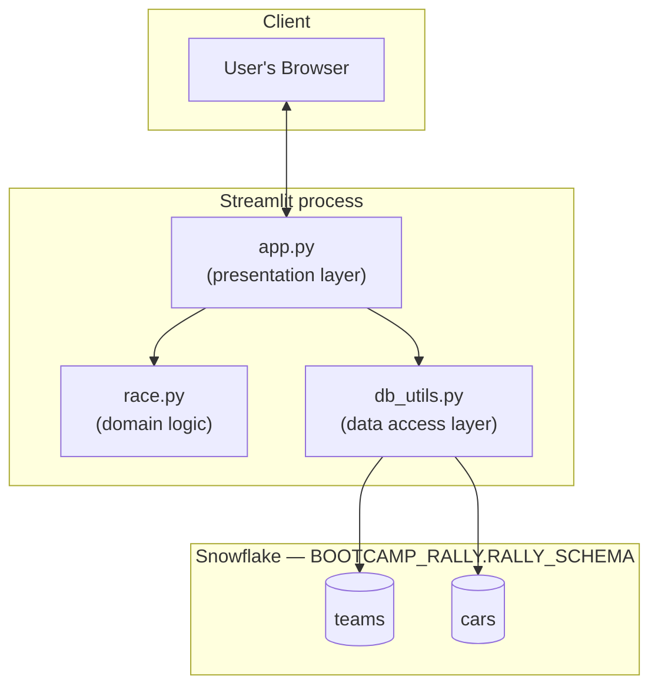
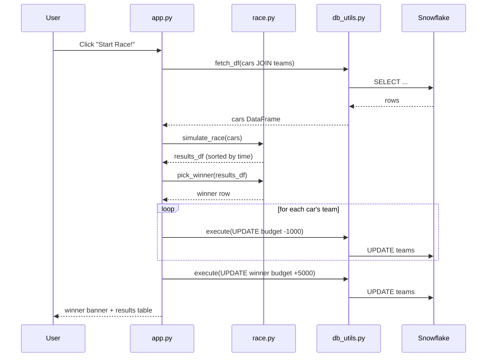
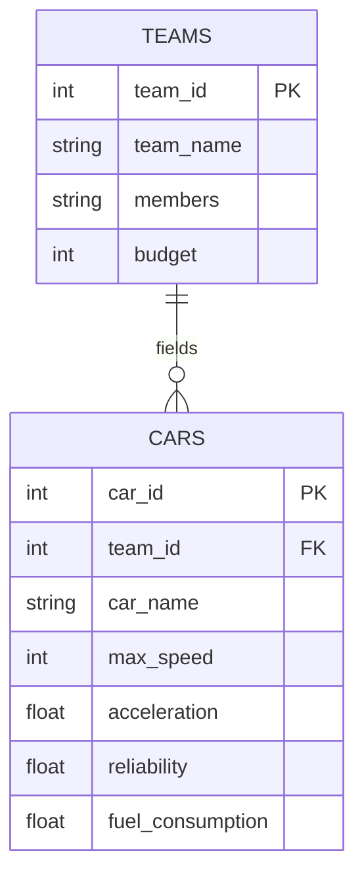

# Architecture

## Overview

Bootcamp Rally Racing App is a single-process [Streamlit](https://streamlit.io/) application with
no backend server of its own — Streamlit *is* the server. It renders a UI, reads/writes a
Snowflake database directly from the same process, and re-runs top-to-bottom on every user
interaction (Streamlit's execution model).

The codebase is split into three layers so that each has one job:

| File | Layer | Responsibility |
|---|---|---|
| [`app.py`](../app.py) | Presentation | Renders the UI, wires up forms/buttons, calls the layers below |
| [`race.py`](../race.py) | Domain logic | Pure race simulation — no I/O, no Streamlit, easy to unit test |
| [`db_utils.py`](../db_utils.py) | Data access | Owns the Snowflake connection and raw SQL execution |

## Request / interaction flow

Every interaction (page load, form submit, button click) triggers a full script re-run. The
"Start Race" click is the most involved path:

`race.py` deliberately has no imports from Streamlit or `db_utils` — it takes a DataFrame in and
returns a DataFrame out, which is what makes it unit-testable without a live database (see
[CONTRIBUTING.md](../CONTRIBUTING.md#testing)).

## Data model

Inferred from the SQL in `app.py`/`db_utils.py` — there is no migrations folder, so this is the
schema as used today:

Race scoring (`race.py`): for each car, `base_time = 100 / max_speed` plus a random reliability
penalty `uniform(0, 1 - reliability)`. Lowest total time wins. Every participating team loses
1000 budget for entering; the winning team gains 5000.

## Secrets & configuration

`db_utils.get_connection()` resolves Snowflake credentials in this order:

1. `st.secrets["snowflake"]` — populated from **`.streamlit/secrets.toml`** (Streamlit's
   standard location, read automatically, git-ignored).
2. Environment variables (`SNOWFLAKE_USER`, `SNOWFLAKE_PASSWORD`, `SNOWFLAKE_ACCOUNT`,
   `SNOWFLAKE_WAREHOUSE`, `SNOWFLAKE_DATABASE`, `SNOWFLAKE_SCHEMA`) — populated from `.env` via
   `python-dotenv` for local scripts/tests that don't go through Streamlit.

**Note on repo history:** earlier commits on `main` contained a `secrets.toml` at the repo root
with real credentials, and a `db_utils.py` revision that printed the Snowflake user/account to
logs. Both have been removed — the credential-bearing file was purged from git history, and the
debug `print()` calls were dropped from `db_utils.py`. If you have an old clone, re-clone rather
than pulling, and never commit `secrets.toml` or `.env`; only `.streamlit/secrets.toml` (or
env vars) should ever hold real credentials, and both are git-ignored.

## Known limitations / next steps

- No automated tests yet — `race.py` was extracted specifically to make this tractable.
- No input validation on the "Add Team"/"Add Car" forms (e.g. empty names, duplicate team names).
- Every DB call opens and closes a fresh Snowflake connection (`db_utils.py`); fine at bootcamp
  scale, worth pooling if usage grows.
- No user auth — anyone who can reach the app can add teams/cars and mutate budgets.
